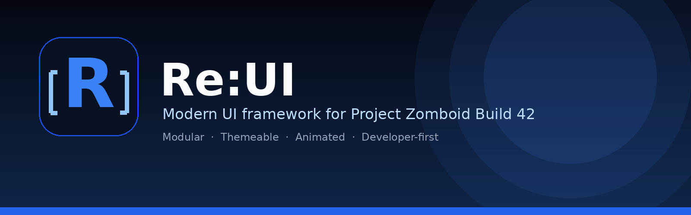

<p align="center">
  
</p>

<h1 align="center">Re:UI</h1>

<p align="center">
  A modern, modular and themeable UI framework for Project Zomboid Build 42.
</p>

<p align="center">
  <a href="LICENSE"></a>
  <a href="ROADMAP.md"></a>
  <a href="COMPATIBILITY.md"></a>
  <a href="CONTRIBUTING.md"></a>
</p>

---

## What is Re:UI?

Re:UI is an open-source UI framework for Project Zomboid. It provides a consistent foundation for building polished interfaces without repeatedly reimplementing rendering, input, focus, layout, theming, animation and window behavior.

Re:UI is designed as infrastructure for other mods—not as a single-purpose UI replacement.

## Highlights

- Reusable controls with a consistent options-based API
- Window management, focus handling and input routing
- Theme tokens for colors, spacing, typography and metrics
- Layout containers for responsive interfaces
- Animation helpers and transitions
- Event bus, observables and commands
- Build-specific API isolation through a compatibility layer
- Official showcase application and component gallery
- Project Zomboid Build 42.20 as the primary target

## Project status

Re:UI 1.0 establishes the framework foundation. The current focus is the official showcase application, documentation, component hardening, accessibility and Build 42.20 compatibility testing.

See the [roadmap](ROADMAP.md) for current milestones.

## Installation

Copy the `ReUI` mod directory into:

```text
C:\Users\<YourUser>\Zomboid\mods\
```

Expected structure:

```text
Zomboid/
└─ mods/
   └─ ReUI/
      ├─ 42/
      ├─ common/
      ├─ mod.info
      └─ poster.png
```

Then enable **Re:UI Framework** in Project Zomboid's Mods menu.

> During development, remove older Re:UI copies before testing. Project Zomboid can load stale Lua files left behind by previous installations.

Read the full [installation guide](docs/installation.md).

## Quick start

```lua
require "ReUI/ReUI"

local window = ReUI.Window:new({
    title = "Inventory",
    width = 600,
    height = 450
})

window:add(
    ReUI.TextBox:new({
        placeholder = "Search..."
    })
)

window:add(
    ReUI.Button:new({
        text = "Save",
        onClick = function()
            print("Saved")
        end
    })
)

window:show()
```

The public API should shield application code from Build-specific ISUI details.

## Repository layout

```text
ReUI/
├─ .github/              GitHub templates and automation
├─ assets/               Branding and documentation assets
├─ docs/                 Framework documentation
├─ examples/             Minimal integration examples
├─ media/                Project Zomboid Lua source
├─ AGENTS.md             Instructions for AI coding agents
├─ ARCHITECTURE.md       Architecture overview
├─ CHANGELOG.md          Release history
├─ COMPATIBILITY.md      Build support policy
├─ CONTRIBUTING.md       Contribution workflow
├─ ROADMAP.md            Planned development
└─ README.md
```

## Documentation

- [Getting started](docs/getting-started.md)
- [Installation](docs/installation.md)
- [Architecture](ARCHITECTURE.md)
- [Controls](docs/controls.md)
- [Layouts](docs/layouts.md)
- [Theming](docs/theming.md)
- [Animations](docs/animations.md)
- [Events and observables](docs/events.md)
- [Window system](docs/windows.md)
- [Testing](docs/testing.md)
- [Performance](docs/performance.md)
- [Compatibility](COMPATIBILITY.md)
- [FAQ](docs/faq.md)

## Showcase

The official Re:UI showcase serves as:

- a component gallery;
- an integration test;
- a theme preview;
- a performance test;
- a source of screenshots and videos;
- a reference implementation for mod developers.

The showcase must never open automatically during normal gameplay. It should be toggled through one documented shortcut or developer command.

## Design principles

1. Architecture before shortcuts.
2. No direct Build-specific API calls from controls.
3. No hardcoded colors, spacing or typography.
4. Every public feature requires documentation and a showcase example.
5. Prefer composition over inheritance.
6. Avoid per-frame allocations and duplicated input logic.
7. Keep the public API stable wherever practical.

## Contributing

Contributions are welcome. Read [CONTRIBUTING.md](CONTRIBUTING.md), [STYLE_GUIDE.md](STYLE_GUIDE.md) and [CODE_OF_CONDUCT.md](CODE_OF_CONDUCT.md) before opening a pull request.

## Security

Please do not publish security-sensitive issues publicly. Follow [SECURITY.md](SECURITY.md).

## License

Re:UI is released under the [MIT License](LICENSE).
